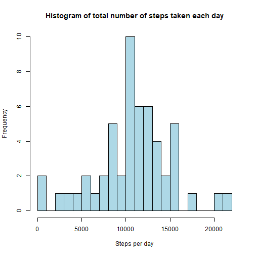
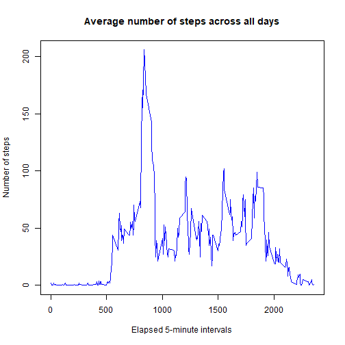
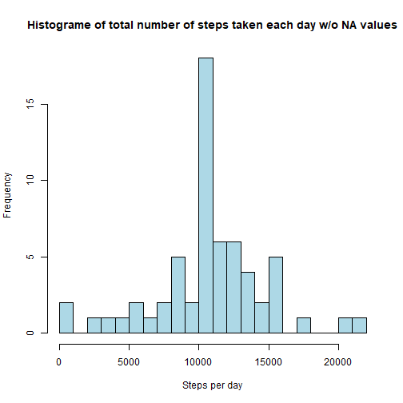
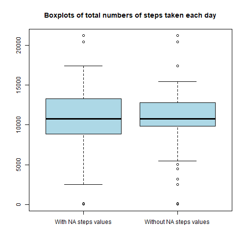
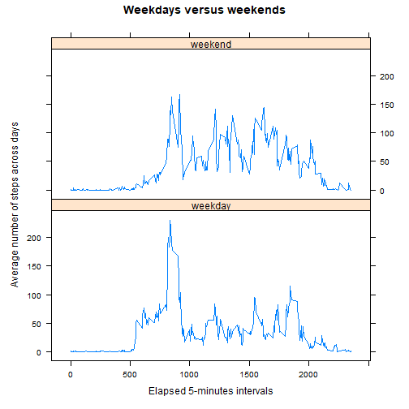

Personal activity monitoring
================================================

## Introduction

It is now possible to collect a large amount of data about personal movement using activity monitoring devices such as a [Fitbit](http://www.fitbit.com), [Nike Fuelband](http://www.nike.com/us/en_us/c/nikeplus-fuelband), or [Jawbone Up](https://jawbone.com/up). These type of devices are part of the “quantified self” movement – a group of enthusiasts who take measurements about themselves regularly to improve their health, to find patterns in their behavior, or because they are tech geeks. But these data remain under-utilized both because the raw data are hard to obtain and there is a lack of statistical methods and software for processing and interpreting the data.

This study makes use of data from a personal activity monitoring device. This device collects data at 5 minute intervals through out the day. The data consists of two months of data from an anonymous individual collected during the months of October and November, 2012 and include the number of steps taken in 5 minute intervals each day.

## Loading packages

We first load packages that we will need for this study.


```r
library(knitr)
library(dplyr)
library(lattice)
```

## Getting the dataset

The dataset is available at the following URL:

[DatasetActivity monitoring data](https://d396qusza40orc.cloudfront.net/repdata%2Fdata%2Factivity.zip)

We download it, unzip it and delete the zip file as it is not useful. The dataset is the CSV file named "activity.csv".


```r
download.file("https://d396qusza40orc.cloudfront.net/repdata%2Fdata%2Factivity.zip", "activity.zip")
unzip("activity.zip")
file.remove("activity.zip")
```

```
## [1] TRUE
```

We now load the "activity.csv" file and take a look at the data.


```r
data <- read.csv("activity.csv")
str(data)
```

```
## 'data.frame':	17568 obs. of  3 variables:
##  $ steps   : int  NA NA NA NA NA NA NA NA NA NA ...
##  $ date    : chr  "2012-10-01" "2012-10-01" "2012-10-01" "2012-10-01" ...
##  $ interval: int  0 5 10 15 20 25 30 35 40 45 ...
```

The variables included in this dataset are:

1. _steps_: Number of steps taken in a 5-minute interval (missing values are coded as NA)

2. _date_: The date on which the measurement was taken in YYYY-MM-DD format

3. _interval_: Identifier for the 5-minute interval in which measurement was taken

There are 17,568 observations.

The values of the _date_ variable are provided as characters, so we convert them to dates.


```r
data$date <- as.Date(data$date, "%Y-%m-%d")
```

## What is the mean total number of steps taken per day?

**1. Calculate the total number of steps per day (ignoring NA values)**


```r
steps_per_day <- aggregate(steps ~ date, data, sum, na.rm = TRUE)
head(steps_per_day)
```

```
##         date steps
## 1 2012-10-02   126
## 2 2012-10-03 11352
## 3 2012-10-04 12116
## 4 2012-10-05 13294
## 5 2012-10-06 15420
## 6 2012-10-07 11015
```

**2. Make a histogram of the total number of steps taken each day**


```r
hist(steps_per_day$steps, 
            breaks = 20,
            col = "lightblue",
            xlab = "Steps per day",
            main = "Histogram of total number of steps taken each day")
```



**3. Calculate and report the mean and median of the total number of steps taken per day**


```r
summary(steps_per_day)
```

```
##       date                steps      
##  Min.   :2012-10-02   Min.   :   41  
##  1st Qu.:2012-10-16   1st Qu.: 8841  
##  Median :2012-10-29   Median :10765  
##  Mean   :2012-10-30   Mean   :10766  
##  3rd Qu.:2012-11-16   3rd Qu.:13294  
##  Max.   :2012-11-29   Max.   :21194
```

The mean of the total number of steps taken each day is 10766. The median is 10765.

## What is the average daily activity pattern?

**1. Make a time series plot (i.e. type = "l") of the 5-minute interval (x-axis) and the average number of steps taken, averaged across all days (y-axis)**


```r
# We round the mean numbers of steps to the closest integers
steps_per_interval_means <- data %>%
                           group_by(interval) %>%
                           summarise(steps = round(mean(steps, na.rm = TRUE)))

plot(steps ~ interval,
        data = steps_per_interval_means,
        type = "l",
        col = "blue",
        xlab = "Elapsed 5-minute intervals",
        ylab = "Number of steps", 
        main = "Average number of steps across all days")
```



There are two noticeable features on the time series:

- There is no significant activity from interval 1 to interval 500 approximately. This corresponds to night hours as measurements are taken from the beginning of the day.
- There is a tall peak of activity in morning hours. The interval ID where the maximum value of the average number of steps is reached is calculated in the next section.


**2. Which 5-minute interval, on average across all the days in the dataset, contains the maximum number of steps?**


```r
max_index <- which.max(steps_per_interval_means$steps)
print(steps_per_interval_means[max_index, ]$interval)
```

```
## [1] 835
```

The interval with ID 835 contains the maximum number of steps averaged across all days.

We can calculate the time of the day that corresponds to this interval knowing that a measurement was taken every 5 minutes. We get the row number in the _data_ dataframe of the first occurrence of interval 835 and multiply it by 5 to obtain the number of minutes that have elapsed since the beginning of the day at 0:00am.


```r
first_835 = which(data$interval == 835)[1]
elapsed = first_835 * 5
paste(floor(elapsed/60), ":", elapsed %% 60, sep = '')
```

```
## [1] "8:40"
```

Interval ID 835 corresponds to measurements taken at 8:40am. We can't speculate about the reasons behind this peak of activity as we have no information we could use. 

## Inputing missing values

**1. Calculate and report the total number of missing values in the dataset (i.e. the total number of rows with NAs)**


```r
summary(data)
```

```
##      steps             date               interval     
##  Min.   :  0.00   Min.   :2012-10-01   Min.   :   0.0  
##  1st Qu.:  0.00   1st Qu.:2012-10-16   1st Qu.: 588.8  
##  Median :  0.00   Median :2012-10-31   Median :1177.5  
##  Mean   : 37.38   Mean   :2012-10-31   Mean   :1177.5  
##  3rd Qu.: 12.00   3rd Qu.:2012-11-15   3rd Qu.:1766.2  
##  Max.   :806.00   Max.   :2012-11-30   Max.   :2355.0  
##  NA's   :2304
```

The _steps_ variable has 2304 NA values. The other variables don't have any.

Therefore, the number of rows with NA values is equal to 2304.

**2. Devise a strategy for filling in all of the missing values in the dataset. The strategy does not need to be sophisticated. For example, you could use the mean/median for that day, or the mean for that 5-minute interval, etc.**

We calculate the percentage of NA values of the _steps_ variable for each interval, averaged across all days, and run some statistics on these percentages.


```r
data <- data %>%
        group_by(interval) %>%
        mutate(steps_NA_percent = mean(is.na(steps)))

summary(data$steps_NA_percent)
```

```
##    Min. 1st Qu.  Median    Mean 3rd Qu.    Max. 
##  0.1311  0.1311  0.1311  0.1311  0.1311  0.1311
```

The _steps_ variable contains no more than 13.1% of NA values in each interval, averaged across all days. As this percentage is relatively low, it is a reasonable choice to use the mean number of steps per interval across all days to fill in the NA values of the _steps_ variable. 

**3. Create a new dataset that is equal to the original dataset but with the missing data filled in.**

We implement the strategy described above to create a new dataset called _data_no_NA_ that does not contain any NA values. 


```r
data <- data %>%
        group_by(interval) %>%
        mutate(steps_no_NA = ifelse(is.na(steps), round(mean(steps, na.rm = TRUE)), steps))
               
data_no_NA = data.frame(steps = data$steps_no_NA, date = data$date, interval = data$interval)

summary(data_no_NA)
```

```
##      steps             date               interval     
##  Min.   :  0.00   Min.   :2012-10-01   Min.   :   0.0  
##  1st Qu.:  0.00   1st Qu.:2012-10-16   1st Qu.: 588.8  
##  Median :  0.00   Median :2012-10-31   Median :1177.5  
##  Mean   : 37.38   Mean   :2012-10-31   Mean   :1177.5  
##  3rd Qu.: 27.00   3rd Qu.:2012-11-15   3rd Qu.:1766.2  
##  Max.   :806.00   Max.   :2012-11-30   Max.   :2355.0
```

There are no NA values in the new dataset.

**4. Make a histogram of the total number of steps taken each day and Calculate and report the mean and median total number of steps taken per day. Do these values differ from the estimates from the first part of the assignment? What is the impact of imputing missing data on the estimates of the total daily number of steps?**


```r
steps_per_day_no_NA <- aggregate(steps ~ date, data_no_NA, sum, na.rm = TRUE)

hist(steps_per_day_no_NA$steps, 
        main = "Histograme of total number of steps taken each day w/o NA values",
        xlab = "Steps per day",
        col = "lightblue",
        breaks = 20)
```



```r
summary(steps_per_day)
```

```
##       date                steps      
##  Min.   :2012-10-02   Min.   :   41  
##  1st Qu.:2012-10-16   1st Qu.: 8841  
##  Median :2012-10-29   Median :10765  
##  Mean   :2012-10-30   Mean   :10766  
##  3rd Qu.:2012-11-16   3rd Qu.:13294  
##  Max.   :2012-11-29   Max.   :21194
```

```r
summary(steps_per_day_no_NA)
```

```
##       date                steps      
##  Min.   :2012-10-01   Min.   :   41  
##  1st Qu.:2012-10-16   1st Qu.: 9819  
##  Median :2012-10-31   Median :10762  
##  Mean   :2012-10-31   Mean   :10766  
##  3rd Qu.:2012-11-15   3rd Qu.:12811  
##  Max.   :2012-11-30   Max.   :21194
```

The means of the total number of steps taken each day are the same with and without NA values of the _steps_ variable. There is only a negligible difference between the values of the medians. The min and max values did not change.

However, the histograms show that the distribution is narrower without NA values, i.e. steps per day values are more closely grouped around the median without NA values.

This is better seen on side by side barplots.


```r
boxplot(steps_per_day$steps, steps_per_day_no_NA$steps,
        col = "light blue",
        names = c("With NA steps values", "Without NA steps values"),
        main = "Boxplots of total numbers of steps taken each day")
```




## Are there differences in activity patterns between weekdays and weekends?

For this part the weekdays() function may be of some help here. Use the dataset with the filled-in missing values for this part.

**1. Create a new factor variable in the dataset with two levels – “weekday” and “weekend” indicating whether a given date is a weekday or weekend day.**


```r
data_no_NA <- data_no_NA %>%
              mutate(day = as.factor(
                              ifelse(weekdays(date) == "Saturday" | weekdays(date)== "Sunday",
                                     "weekend", "weekday")))
```

**2. Make a panel plot containing a time series plot (i.e. type= "l") of the 5-minute interval (x-axis) and the average number of steps taken, averaged across all weekday days or weekend days (y-axis). See the README file in the GitHub repository to see an example of what this plot should look like using simulated data.**


```r
mean_steps_per_day <- aggregate(steps ~ interval + day, data_no_NA, mean)
names(mean_steps_per_day) <- c("interval", "day", "steps")

xyplot(steps ~ interval | day, mean_steps_per_day, type = "l", layout = c(1, 2), 
       xlab = "Elapsed 5-minutes intervals",
       ylab = "Average number of steps across days",
       main = "Weekdays versus weekends")
```



Some differences can be observed between weekend and weekday steps patterns. The morning peak is much taller in weekdays than in weekends.The number of steps throughout the rest of the day is higher on average during weekends than during weekdays. Maybe this person works in an office, but we have no way to know that.


